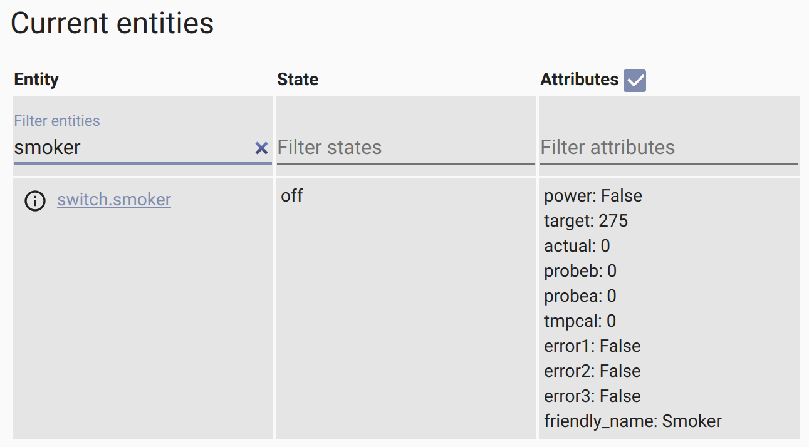

# Recteq Integration for Home Assistant

> **NOTE** - This isn't supported or approved by [recteq][recteq] at all!

This is a custom component for [Home Assistant](https://homeassistant.io) for
monitoring and controlling a [recteq][recteq] smoker. I use it with my RT-590
which is **awesome** by the way. Once installed, it creates a _switch_ entity
to turn the smoker on and off. It has attributes for the target and actual
temperatures as well as the two probes.



At this time, the component can monitor the smoker and report the current
status and attribute values. Toggling the power works too. Other things I'm
working on are:

* Set the target temperature
* Would like to learn how to better integrate with HA's config system

## Installation

I like to `git clone` create `~/config/custom_components/recteq/` but that's
just me. Instead, you can drop `manifest.json` and `switch.py` into that
directory

Then, you need to add a switch for each rectec you want to connect.

```yaml
switch:
  - platform: recteq
    name: Smoker
    host: 192.168.0.123
    device_id: 00000000000000000000
    local_key: 0000000000000000
```

I get the `device_id` and `local_key` values from a log file on my Android
phone that has recteq's app installed and configured to control the smoker
already.. I connect it via USB to my laptop and allow MTP when prompted on the
phone. My PC can now browse the phone's filesystem. I found a text file named
`1.abj` in `.../Phone/Android/data/com.ym.rectecgrill/cache/`. In there, I
found a line with a timestamp followed by the word `Business` followed by a
JSON object with `gwId` and `localKey` properties. These coorespond to the
`device_id` and `local_key` values, respectively. The `device_id` is 20
hex-digits long and the `local_key` is 16.

## Credits

I'm Paul Dugas, <paul@dugas.cc>. I learned this was possible and based the code
***heavily*** on prior work by [`SDNick484/rectec_status`][rectec_status]. His
`switch.py` (and thus mine) appears to be based on prior work by
[`fastcolors/localtuya`][localyuya]

[rectec]: https://www.recteq.com/
[rectec_status]: https://github.com/SDNick484/rectec_status
[localtuya]: https://github.com/fastcolors/localtuya
