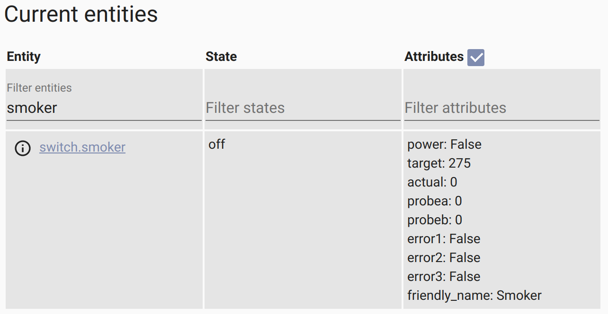
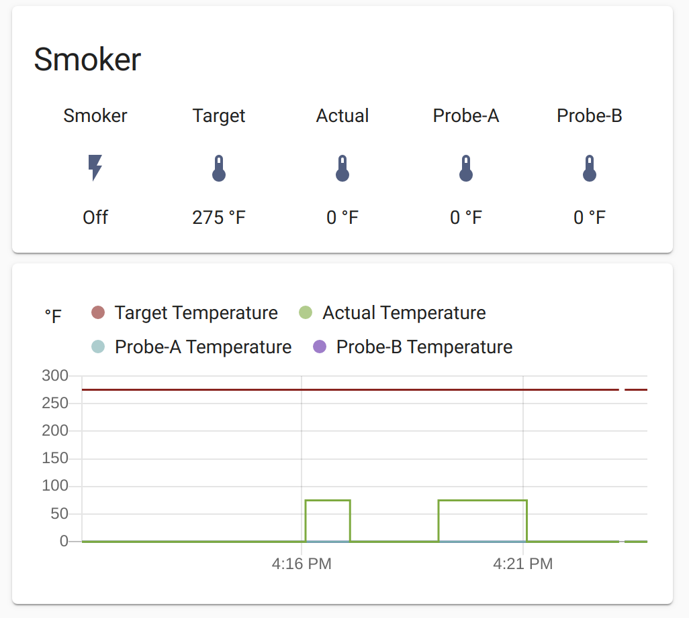
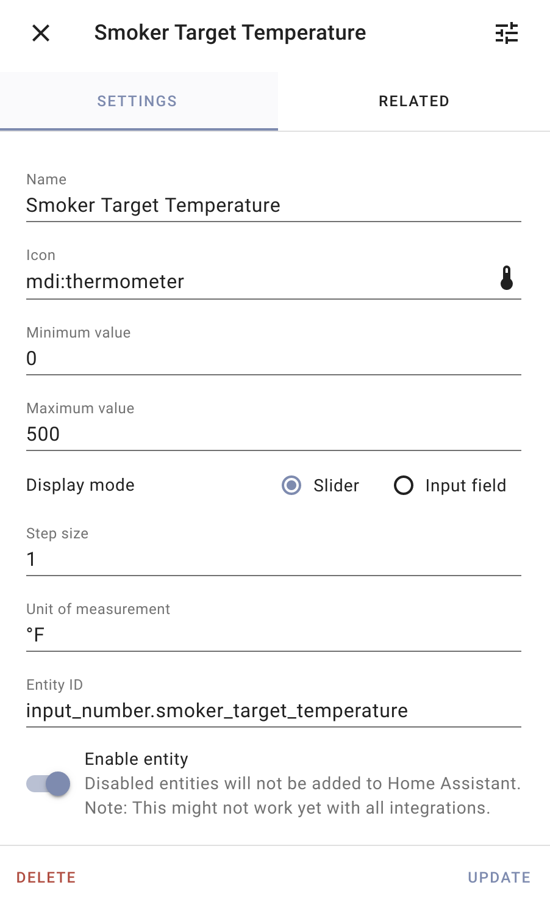

# Recteq Integration for Home Assistant

> **NOTE** - This isn't supported or approved by [recteq][recteq] at all!

This is a custom component for [Home Assistant](https://homeassistant.io) for
monitor and control [recteq][recteq] grills and smokers. I use it with my RT-590
which is **freakin' awesome** by the way. Once installed, it creates a _switch_ entity
to turn the smoker on and off. It provides attributes for the target and actual
temperatures as well as the two probes.





## Installation

I like to use `git clone` to create `~/config/custom_components/recteq/` but
that's just me. You need to copy `*.json` and `*.py` from here to there.

## Configuration

You need to add an entry under `switch:` in `configuration.yaml` for each
rectec you want to connect.

```yaml
switch:
  - platform: recteq
    name: Smoker
    host: 192.168.0.123
    device_id: 00000000000000000000
    local_key: 0000000000000000
  - platform: recteq
    name: Grill
    host: 192.168.0.124
    device_id: 11111111111111111111
    local_key: 1111111111111111
```

I get the `device_id` and `local_key` values from a log file on my Android
phone that has recteq's app installed and configured to control the smoker
already.. I connect it via USB to my laptop and allow MTP when prompted on the
phone. My PC can now browse the phone's filesystem. I found a text file named
`1.abj` in `.../Phone/Android/data/com.ym.rectecgrill/cache/`. In there, I
found a line with a timestamp followed by the word `Business` followed by a
JSON object with `gwId` and `localKey` properties. These coorespond to the
`device_id` and `local_key` values, respectively. The `device_id` is 20
hex-digits long and the `local_key` is 16.

I like to setup template-sensors so the temperature attributes are more
accessible:

```yaml
sensor:
  - platform: template
    sensors:
      smoker_target_temperature:
        friendly_name: Target Temperature
        value_template: "{{ state_attr('switch.smoker', 'target') }}"
        icon_template: mdi:thermometer
        unit_of_measurement: °F
      smoker_actual_temperature:
        friendly_name: Actual Temperature
        value_template: "{{ state_attr('switch.smoker', 'actual') }}"
        icon_template: mdi:thermometer
      smoker_probea_temperature:
        friendly_name: Probe-A Temperature
        value_template: "{{ state_attr('switch.smoker', 'probea') }}"
        icon_template: mdi:thermometer
      smoker_probeb_temperature:
        friendly_name: Probe-B Temperature
        value_template: "{{ state_attr('switch.smoker', 'probeb') }}"
        icon_template: mdi:thermometer
        unit_of_measurement: °F
```

## Service

The `recteq.set_target` service is provided to set the target temperature in
scripts or automations. I like to create an _input_number_ like the one below.



Then I create a Glance Card like below. I can tap the the Power button to turn it on an off. Tapping the target temperature brings up the _more info_ panel where I can adjust the slider.

```yaml
type: glance
entities:
  - entity: switch.smoker
    name: Power
    tap_action:
      action: toggle
  - entity: input_number.smoker_target_temperature
    name: Target
  - entity: sensor.smoker_actual_temperature
    name: Actual
  - entity: sensor.smoker_probea_temperature
    name: Probe-A
  - entity: sensor.smoker_probeb_temperature
    name: Probe-B
title: Smoker
state_color: true
```

I have a couple automations the tie it all together.

```yaml
- id: '1601844809738'
  alias: Smoker Target Attribute Changed
  description: ''
  trigger:
  - platform: state
    entity_id: switch.smoker
    attribute: target
  condition: []
  action:
  - service: input_number.set_value
    entity_id: input_number.smoker_target_temperature
    data:
      value: '{{ state_attr(''switch.smoker'',''target'') | int }}'
  mode: single
- id: '1601844956599'
  alias: Smoker Target Input Changed
  description: ''
  trigger:
  - platform: state
    entity_id: input_number.smoker_target_temperature
  condition: []
  action:
  - service: recteq.set_target
    data:
      entity_id: switch.smoker
      temperature: '{{ states(''input_number.smoker_target_temperature'') | int }}'
  mode: single
```
## Notes

* The code triggers an update after turning the rectec ON or OFF or setting the
  target temperature but it seems to take a while for changes to be reflected
  in the responses. Turn on logging in `configuration.yaml` to see the details.

  ```yaml
  logger:
  default: info
  logs:
    custom_components.recteq.switch: debug
  ```

* I'd like to explore using HA's configuration logic instead of relying on YAML
  since that appears to be where HS is going.

## Credits

I'm Paul Dugas, <paul@dugas.cc>. I learned this was possible and based the code
***heavily*** on prior work by [`SDNick484/rectec_status`][rectec_status]. His
`rt.py` appears to be based on prior work by [`fastcolors/localtuya`][localtuya]
and is the basis of my original [`switch.py`](switch.py). I cleaned some things
up and added a service to control the target temperature.

[recteq]: https://www.recteq.com/
[rectec_status]: https://github.com/SDNick484/rectec_status
[localtuya]: https://github.com/fastcolors/localtuya
